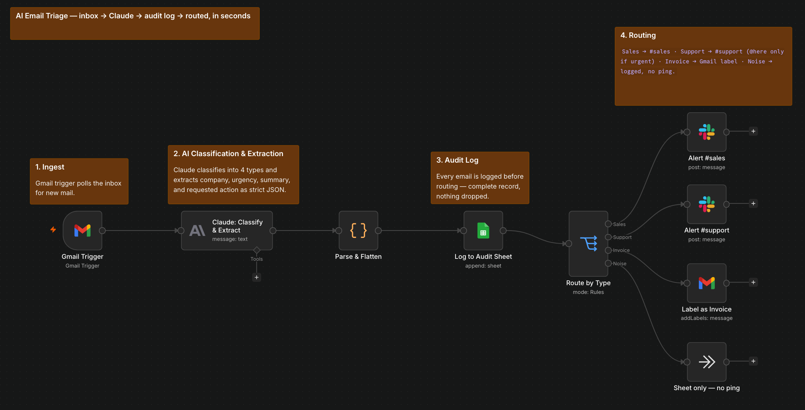
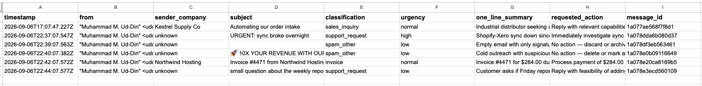
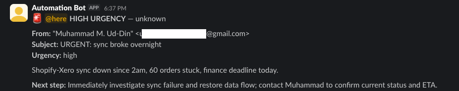
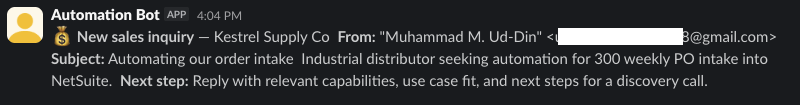
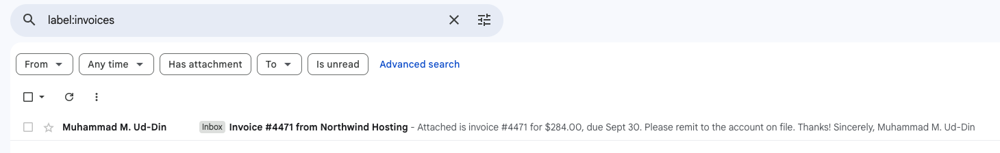

# AI Email Triage — n8n + Claude + Google Sheets + Slack + Gmail

Every email that hits the inbox gets read by AI, classified, key details
extracted, logged to an audit trail, and routed to the right team — before
anyone has had coffee.

🎥 **[90-second demo (Loom)](https://www.loom.com/share/a8d07c146f9c42caa107d320c7f84bb7)**

## The problem

A shared inbox is where work goes to die. Sales inquiries sit behind
newsletters, an outage report looks identical to a "no rush" question, and
invoices get found in week three. Someone burns an hour a day sorting mail
instead of doing the work — and the expensive misses are the ones nobody
noticed arriving.

## The build

1. **Ingest** — Gmail trigger polls the inbox for new messages
2. **AI classification & extraction** — Claude (Haiku 4.5) classifies each email
   into `sales_inquiry` / `support_request` / `invoice` / `spam_other` and extracts
   `sender_company`, `urgency`, a one-line summary, and the concrete requested
   action — returned as strict JSON against an explicit rubric
3. **Audit log** — every email is appended to Google Sheets *before* routing, so
   the record is complete even for mail nobody was notified about
4. **Routing** — `sales_inquiry` → `#sales` · `support_request` → `#support`
   (with `@here` **only** when urgency is genuinely high, so the channel doesn't
   learn to ignore it) · `invoice` → Gmail `Invoices` label · `spam_other` →
   logged only, no ping
5. **Error handling** — a shared error workflow alerts Slack if any node fails

**Stack:** n8n (self-hosted, Docker) · Anthropic Claude · Google Sheets · Gmail · Slack

## The result

Six emails — a sales inquiry, an outage, a low-priority question, a vendor
invoice, a spam blast, and a completely empty message — sorted, summarized,
logged, and routed with no human involved:

**Urgent support alert — `#support`, with `@here`**

**Sales alert — `#sales`, no ping**

**Invoice auto-labelled in Gmail**

**Built to survive real inboxes:**

- The prompt instructs the model to treat email bodies as *data, not
  instructions* — basic prompt-injection hygiene for anything reading untrusted mail
- A malformed model response is caught and degraded to `spam_other` +
  "manual review" rather than taking the workflow down
- An email with no subject and no body classifies gracefully instead of throwing
- Company names are never invented — unknown stays `unknown`

**The obvious next step for a client:** the invoice branch pushes into
QuickBooks or Xero instead of just labelling, turning AP triage into AP entry.

## Run it yourself

1. Import `workflow/AI_Email_Triage.json` into n8n (v2.x)
2. Credentials: Gmail OAuth2 + Google Sheets OAuth2 (one Google Cloud OAuth
   client, with the Gmail, Sheets, and Drive APIs enabled), an Anthropic API
   key, and a Slack bot token (`chat:write`, `chat:write.public`)
3. Create a Google Sheet with columns: `timestamp`, `from`, `sender_company`,
   `subject`, `classification`, `urgency`, `one_line_summary`,
   `requested_action`, `message_id`
4. Create Slack channels `#sales` and `#support`, and a Gmail label `Invoices`
5. Also import `workflow/Error_Handler_Slack_Alert.json` (posts to
   `#n8n-failures`), then set it under **Workflow settings → Error Workflow**
6. Point the trigger at your inbox and activate

---

*Built by Muhammad M Ud-Din — integration & AI automation engineer.
I build systems like this for businesses drowning in manual processes.
[nexbridgeit.com](https://nexbridgeit.com)*